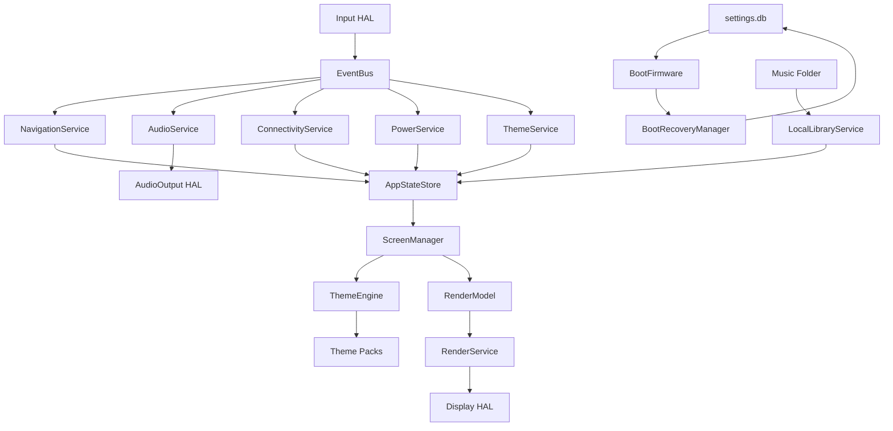

# SHAeR Dependency Graph V1

Status: Required before hardware testing.

## Dependency Rule

HALs may depend on Linux APIs. Firmware services may depend on HAL interfaces. UI/rendering may depend on AppState snapshots. Themes may never depend on services.

