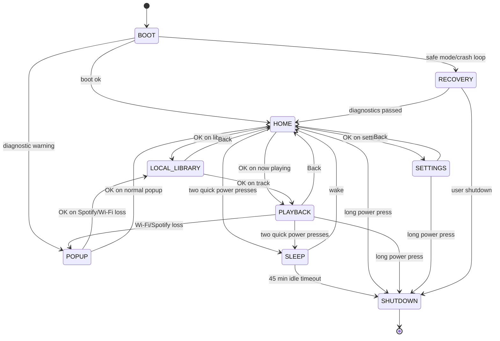

# SHAeR State Machine V1

Status: V1 freeze draft. Firmware state drives behavior. Screens render state; screens do not own logic.

## State Diagram



```text
BOOT
  -> HOME
HOME
  -> LOCAL_LIBRARY
  -> SPOTIFY_CONNECT
  -> MEMORY_MODE
  -> SETTINGS
  -> AOD
  -> SLEEP
  -> CHARGING
  -> SHUTDOWN
LOCAL_LIBRARY -> PLAYBACK | MEMORY_MODE | HOME | POPUP
SPOTIFY_CONNECT -> PLAYBACK | POPUP | HOME
PLAYBACK -> HOME | LOCAL_LIBRARY | MEMORY_MODE | POPUP | AOD | SLEEP | CHARGING | SHUTDOWN
VOICE_RECORDING -> MEMORY_MODE | POPUP | SHUTDOWN
MEMORY_MODE -> VOICE_RECORDING | PLAYBACK | HOME | POPUP
SETTINGS -> HOME | POPUP | RECOVERY
POPUP -> previous safe state | LOCAL_LIBRARY | RECOVERY | SHUTDOWN
AOD -> previous safe state | SLEEP | SHUTDOWN
SLEEP -> HOME | SHUTDOWN
CHARGING -> HOME | AOD | SHUTDOWN
RECOVERY -> HOME | FACTORY_RESET | EXPORT_LOGS | SHUTDOWN
SHUTDOWN -> Linux poweroff
```

## Global Input Rules

| Input | Meaning |
|---|---|
| Encoder rotate | Move selection or scrub only where explicitly allowed |
| Encoder press / OK | Confirm |
| Back | Return to previous safe state |
| Play/Pause | Toggle playback where allowed |
| Power short press | Battery saver toggle |
| Power two quick presses | Sleep |
| Power long press | Slow shutdown |

## BOOT

- Entry: systemd starts firmware.
- Exit: settings loaded, minimum HAL checks complete, Home drawable.
- Allowed transitions: HOME, POPUP, RECOVERY, SHUTDOWN.
- Timeout: Home usable by 6 to 8 seconds.
- Animations: anticipation and curiosity, short theme-specific boot reveal.
- Sounds: optional soft boot chime, disabled in battery saver.
- User input: power long press may shut down.

## HOME

- Entry: boot complete, wake complete, or back-stack root.
- Exit: user opens feature or power action changes mode.
- Allowed transitions: LOCAL_LIBRARY, SPOTIFY_CONNECT, PLAYBACK, MEMORY_MODE, SETTINGS, POPUP, AOD, SLEEP, CHARGING, SHUTDOWN.
- Timeout: optional AOD after configurable idle period.
- Animations: low motion menu focus, theme world visible.
- Sounds: optional cursor ticks.
- User input: full navigation.
- Cold boot menu entries: Spotify Connect, Local Library, Voice Archive.
- Cold boot rule: never resume directly into Now Playing.

## LOCAL_LIBRARY

- Entry: user opens library or Spotify recovery hands off offline.
- Exit: playback starts, user backs out, or popup interrupts.
- Allowed transitions: PLAYBACK, MEMORY_MODE, HOME, POPUP, AOD, SLEEP, SHUTDOWN.
- Timeout: none while user is active.
- Animations: list movement must remain 30 fps target unless battery saver caps it.
- Sounds: subtle focus tick.
- User input: browse, select, back, play.

## SPOTIFY_CONNECT

- Entry: Spotify service reports usable credentials and connection.
- Exit: playback starts, user backs out, Wi-Fi fails, token revoked.
- Allowed transitions: PLAYBACK, POPUP, HOME, SHUTDOWN.
- Timeout: connection attempt should show progress by 2 seconds and fail gracefully by 15 seconds.
- Animations: calm connecting indicator.
- Sounds: none by default.
- User input: back and power controls.

## PLAYBACK

- Entry: local, Spotify, or Bluetooth playback active.
- Exit: stop, source lost, user backs out, power action.
- Allowed transitions: HOME, LOCAL_LIBRARY, MEMORY_MODE, POPUP, AOD, SLEEP, CHARGING, SHUTDOWN.
- Timeout: none while audio plays.
- Animations: calm immersion. Album art/progress motion must be throttled by power policy.
- Sounds: the music.
- User input: play/pause, next, previous, volume, Memory Mode, back.

## VOICE_RECORDING

- Entry: user starts recording from Memory Mode or quick record.
- Exit: stop, save, cancel, low storage, shutdown.
- Allowed transitions: MEMORY_MODE, POPUP, SHUTDOWN.
- Timeout: warn on long recordings; hard stop based on free storage policy.
- Animations: clear recording indicator, never frantic.
- Sounds: optional start/stop tones only if they will not be captured loudly.
- User input: stop/save, cancel, power long press.

## MEMORY_MODE

- Entry: user opens Memory Mode from Home, Now Playing, Library, album, playlist, or track.
- Exit: user records, links, plays, deletes, or backs out.
- Allowed transitions: VOICE_RECORDING, PLAYBACK, LOCAL_LIBRARY, HOME, POPUP, SHUTDOWN.
- Timeout: none while browsing memories.
- Animations: intimate archive feeling, slower and quieter than music browsing.
- Sounds: optional soft confirmation.
- User input: browse album/playlist/song links, record, attach, detach, play memory.

## SETTINGS

- Entry: user opens settings.
- Exit: back, save, or recovery action.
- Allowed transitions: HOME, POPUP, RECOVERY, SHUTDOWN.
- Timeout: optional return Home after long inactivity.
- Animations: nostalgic and legible.
- Sounds: optional ticks.
- User input: theme, crossfade, ReplayGain, quality, power, Bluetooth, Wi-Fi, recovery.

## POPUP

- Entry: blocking or non-blocking notification.
- Exit: confirm, cancel, timeout only for non-blocking.
- Allowed transitions: previous safe state, LOCAL_LIBRARY, RECOVERY, SHUTDOWN.
- Timeout: blocking popups do not auto-dismiss.
- Animations: playful, never alarming.
- Sounds: soft alert only for user-actionable events.
- User input: OK, sometimes Back if non-destructive.

## AOD

- Entry: idle timeout or user command.
- Exit: input, charger event, long power press, sleep timeout.
- Allowed transitions: previous safe state, SLEEP, CHARGING, SHUTDOWN.
- Timeout: may enter Sleep after configured idle if no music plays.
- Animations: 1 to 5 fps equivalent, dim, theme-aware.
- Sounds: none.
- User input: any normal input wakes, power rules apply.

## CHARGING

- Entry: charger attached or shutdown charge mode.
- Exit: unplug, user wake, long power press.
- Allowed transitions: HOME, AOD, SHUTDOWN.
- Timeout: AOD after inactivity.
- Animations: warmth and craftsmanship.
- Sounds: none by default.
- User input: wake, power actions.

## SLEEP

- Entry: two quick power presses or AOD timeout.
- Exit: button wake, charger attach, auto shutdown.
- Allowed transitions: HOME, CHARGING, SHUTDOWN.
- Timeout: if no music is playing, auto shutdown after 45 minutes.
- Animations: display off or minimal pre-sleep fade.
- Sounds: none.
- User input: wake/power only.

## SHUTDOWN

- Entry: long press, critical battery, recovery command, or sleep auto timeout.
- Exit: Linux poweroff.
- Allowed transitions: none except simulator/dev reboot.
- Timeout: complete within 10 seconds unless filesystem repair is running.
- Animations: slow goodbye message.
- Sounds: optional soft click, then silence.
- User input: ignored after commit point.

## RECOVERY

- Entry: startup failure, settings command, diagnostic button chord.
- Exit: Home, factory reset, export logs, shutdown.
- Allowed transitions: HOME, POPUP, SHUTDOWN.
- Timeout: none.
- Animations: plain, test-focused, not decorative.
- Sounds: only for audio test.
- User input: diagnostic menu.

Required recovery tests: Display, Button, Encoder, Audio, Battery status, Bluetooth, Wi-Fi, SD card, Factory reset, Export logs.

## Transition Matrix

| Current State | Event/Input | Next State | Owner |
|---|---|---|---|
| BOOT | boot ok | HOME | BootFirmware |
| BOOT | crash loop | RECOVERY/Safe Mode | BootRecoveryManager |
| BOOT | diagnostic warning | POPUP | FirmwareRuntime |
| HOME | Encoder up/down | HOME | NavigationService |
| HOME | OK on Spotify Connect | SPOTIFY_CONNECT | NavigationService/SpotifyService |
| HOME | OK on Local Library | LOCAL_LIBRARY | NavigationService |
| HOME | OK on Voice Archive | MEMORY_MODE | NavigationService/RecordingService |
| HOME | OK on Settings | SETTINGS | NavigationService |
| HOME | Theme command | HOME | ThemeService |
| LOCAL_LIBRARY | Encoder up/down | LOCAL_LIBRARY | NavigationService |
| LOCAL_LIBRARY | OK on track | PLAYBACK | AudioService then NavigationService |
| LOCAL_LIBRARY | Back | HOME | NavigationService |
| PLAYBACK | Play/Pause | PLAYBACK | AudioService |
| PLAYBACK | Volume +/- | PLAYBACK | AudioService/AppState |
| PLAYBACK | Wi-Fi lost | POPUP | AudioService/ConnectivityService |
| PLAYBACK | Spotify lost | POPUP | AudioService/ConnectivityService |
| POPUP | OK with `open_library` | LOCAL_LIBRARY | NavigationService |
| POPUP | OK default | Previous safe state | NavigationService |
| SETTINGS | OK on Theme | SETTINGS | ThemeService |
| SETTINGS | Back | HOME | NavigationService |
| Any active state | Power short press | same state, Battery Saver toggled | PowerService |
| Any active state | Two quick power presses | SLEEP | PowerService |
| SLEEP | 45 min idle and no playback | SHUTDOWN | PowerService |
| Any active state | Long power press | SHUTDOWN | PowerService |
